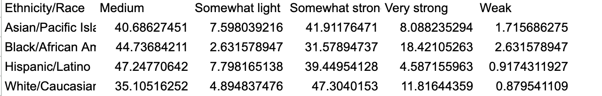
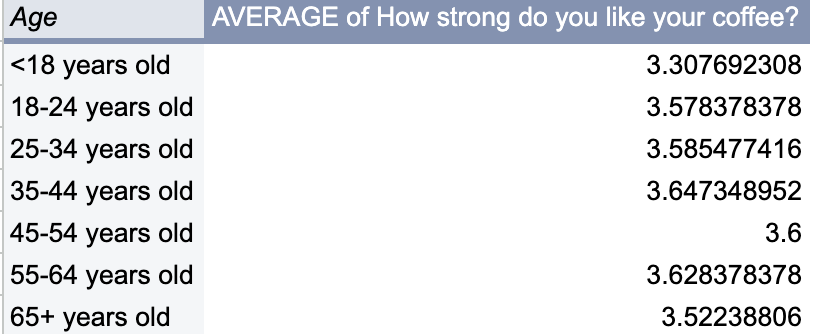
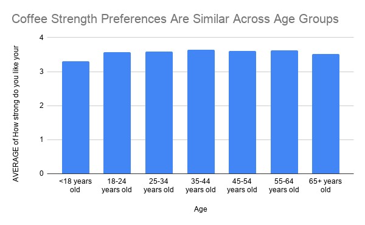

# Coffee Habits Differ by Age in the Great American Coffee Taste Test
## About the Data and Its Limitations
This project uses anonymized survey responses from the Great American Coffee Taste Test, a virtual blind coffee tasting hosted by James Hoffmann, a coffee YouTuber and former World Barista Champion. The dataset was not created by a government agency, puclic institutions, or nonprofit organization. It was generated from people who voluntarily participated in the coffee tasting and answered questions about their demographics, coffee drinking habits and preferences. The source is useful because the responses were collected through a specific public tasting event and the dataset is anonymnized. But, it should not be treated as a perfect representation of all coffee drinkers. The people who participated were likely already interested in coffee, already familiar with James Hoffman or motivated enough to join a blind tasting. Because of that the survey may overrepresent people who care more about coffee than the public. There are also some challenges in using the data. Some responses are blank, and some questions allow multiple answers which can make certain columns harder to analyze in Shets. The dataset itself can show patterns among survey participants, such as differences in reported coffee drinking habits by age group, but it cannot prove why those differences exist. For example, if older respondents report drinking more coffee, the data does not explain whether that is because it's heavily due to their lifestyle, income, or another factor. Because the survey participants chose to take part in a coffee tasting, I would be careful not to present the results as representing all coffee drinkers. The findings are better understood as patterns among Great American Coffee Taste Test participants.  The safest way to describe this dataset is as a survey of Great American Coffee Taste Test participants and not a scientific survey of the general public.

## Analysis Process
To analyze the data, I imported the anonymnized survey responses into Google Sheets and cleaned up the dataset.I focused on columns that were useful for answering my main question, and I also renamed some of the columns so they would be shorter and easier to use in pivot tables and charts. Some columns were difficult to use because they included multiple answers or blank responses, so I filtered those out when necessary. [Refrence my Google Sheet here](https://docs.google.com/spreadsheets/d/18kxMZtfBzEOnZqkaZBdzp9Mjk9AA-PMeddysLSuTBG0/edit?usp=sharing)

For my first analysis, I created a pivot table with age group as the row category and cups of coffee per day as the value. I summarized the cups per day column by average in order to compare reported coffee consumption across age groups. This allowed me to see whether younger and older respondents reported different daily coffee habits. The pivot table showed that average coffee consumption generally increased with age. Respondents under 18 reported the lowest average daily coffee intake, while respondents in the 55–64 the highest averages. 

I also compared race/ethnicity with preferred coffee strength to see whether different respondent groups showed different patterns in how strong they like their coffee. Since the number of participants in each race/ethnicity group was different, I converted the results into percentages instead of only using raw counts, which made the groups easier to compare more fairly. The following is the percentage pivot table that I made myself, using the equation, 	`(Number of respondents in one ethnicity/race group who chose a specific coffee strength ÷ Total number of respondents in that ethnicity/race group) × 100` for each percentage in a cell. Refer to the following.

Overall, the chart suggests that most groups preferred coffee that was either medium or somewhat strong. Hispanic/Latino respondents leaned more toward medium coffee, while White/Caucasian respondents had a slightly larger share choosing somewhat strong coffee.

I felt that it would be easier to analyze if I convered  coffee strength preferences into a 1–5 scale (weak = 1 , somewhat light = 2, medium = 3, somewhat strong = 4, very storng = 5) the pivot table shows that all age groups preferred coffee that was somewhat strong on average. Respondents under 18 had the lowest average strength preference, while respondents ages 35–44 and 55–64 had the highest. It is interesting to see that preferred coffee strength does not change dramatically by age, but there is a slight pattern where middle-aged respondents preferred somewhat stronger coffee than the youngest and oldest groups. The following is the pivot table that I first made. 

The following is the table that I have made based on the pivot table above.

## Ending Summary, Ethical Concerns, and Reporting Process 

This project looked at coffee habits among participants in the Great American Coffee Taste Test. Using the anonymized survey responses, I focused on how coffee habits differed by age and how preferred coffee strength varied across race/ethnicity groups. 

The first analysis found that reported consumption generally increased with age. Respondents in the 55–64 age group reported the highest average daily intake at approximately 2.19 cups per day whiile respondents under 18 reported the lowest. The trend was not perfectly linear as the 65+ group reported slightly lower averages than the 55–64 group, but the overall pattern still suggests that older respondents tend to drink more coffee than younger generation in this sample.

The second analyis compared preferred coffee strength across race and ethnicity groups. Most respondents across all groups preferred medium or somewhat strong coffee. Hispanic/Latino respondents had a larger share choosing medium, while White/Caucasian respondents had more people choosing somewhat strong. Black/African American respondents showed a relatively higher share choosing very strong coffee. Because the groups in this dataset were unequal in size, with White/Caucasian respondents making up the most, I used a 100% stacked bar chart so that each group's internal distribution could be compared proportionally.

The third analysis examined how preferred coffee strength varies by age group. To make the data easier to analyze numerically, I first filtered the strength preference column and replaced each categorical response with a number (weak: 1, somewhat light: 2, medium: 3, somewhat strong: 4, and very strong: 5. ) I then built a pivot table using age group as the row and the average of the converted strength scores as the value. All age groups fell between 3.3 and 3.65 on average. Respondents under 18 had the lowest average at approximately 3.31, while respondents ages 35–44 had the highest at approximately 3.65. The differences were relatively small, suggesting that preferred coffee strength does not change dramatically with age, though there is a slight pattern where middle-aged respondents (35–54) preferred marginally stronger coffee than the youngest and oldest groups.

The most important ethical concern in this project is the risk of overgeneralizing from a nonrepresentative sample. Participants were self selected coffee enthusiasts who opted into a virtual blind tasting. They are likely already more engaged with coffee culture than the average person. Treating these results as representative of all coffee drinkers or of any demographic group more broadly, would be misleading.

This concern is especially significant for the race and ethnicity analysis. The dataset shows descriptive differences in preference patterns among survey respondents, but it does not and cannot explain why those differences exist.

To avoid misrepresentation, all findings in this project are framed around the survey participants specifically, not the general public.

To develop this story further, I would pursue several addittional steps. First, I would seek out a more representative coffee consumption survey, such as data from the National Coffee Association's annual drinking trends report, to cross check whether the age patterns found here hold more broadly. Second, I would want to understand the recruitment pipeline for the Great American Coffee Taste Test more precisely: who was reached, and what that implies about who is missing from the dataset. Third, for the race and ethnicity analysis, I would want to interview respondents directly to understand what drives their preferences, since the dataset can describe patterns but cannot explain causes.
