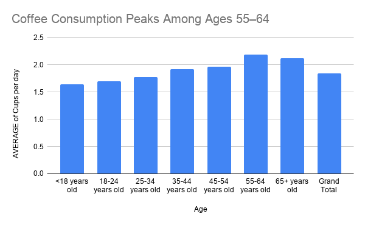
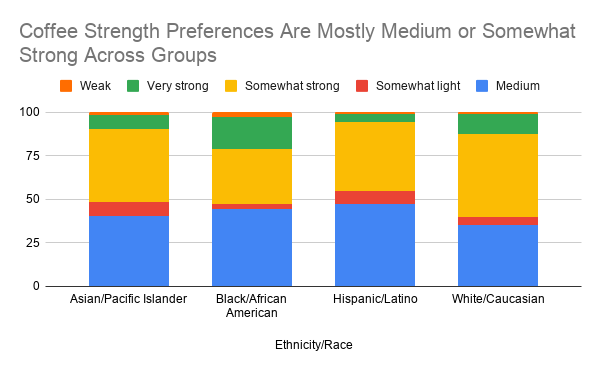

# Coffee Habits Differ by Age in the Great American Coffee Taste Test
## About the Data and Its Limitations
This project uses anonymized survey responses from the Great American Coffee Taste Test, a virtual blind coffee tasting hosted by James Hoffmann, a coffee YouTuber and former World Barista Champion. The dataset was not created by a government agency, puclic institutions, or nonprofit organization. It was generated from people who voluntarily participated in the coffee tasting and answered questions about their demographics, coffee drinking habits and preferences. The source is useful because the responses were collected through a specific public tasting event and the dataset is anonymnized. But, it should not be treated as a perfect representation of all coffee drinkers. The people who participated were likely already interested in coffee, already familiar with James Hoffman or motivated enough to join a blind tasting. Because of that the survey may overrepresent people who care more about coffee than the public. There are also some challenges in using the data. Some responses are blank, and some questions allow multiple answers which can make certain columns harder to analyze in Shets. The dataset itself can show patterns among survey participants, such as differences in reported coffee drinking habits by age group, but it cannot prove why those differences exist. For example, if older respondents report drinking more coffee, the data does not explain whether that is because it's heavily due to their lifestyle, income, or another factor. Because the survey participants chose to take part in a coffee tasting, I would be careful not to present the results as representing all coffee drinkers. The findings are better understood as patterns among Great American Coffee Taste Test participants.  The safest way to describe this dataset is as a survey of Great American Coffee Taste Test participants and not a scientific survey of the general public.

## Analysis Process
To analyze the data, I imported the anonymnized survey responses into Google Sheets and cleaned up the dataset.I focused on columns that were useful for answering my main question, and I also renamed some of the columns so they would be shorter and easier to use in pivot tables and charts. Some columns were difficult to use because they included multiple answers or blank responses, so I filtered those out when necessary. [Refrence my Google Sheet here](https://docs.google.com/spreadsheets/d/18kxMZtfBzEOnZqkaZBdzp9Mjk9AA-PMeddysLSuTBG0/edit?usp=sharing)

For my first analysis, I created a pivot table with age group as the row category and cups of coffee per day as the value. I summarized the cups per day column by average in order to compare reported coffee consumption across age groups. This allowed me to see whether younger and older respondents reported different daily coffee habits. The pivot table showed that average coffee consumption generally increased with age. Respondents under 18 reported the lowest average daily coffee intake, while respondents in the 55–64 the highest averages. 

I also compared race/ethnicity with preferred coffee strength to see whether different respondent groups showed different patterns in how strong they like their coffee. Overall, the chart suggests that most groups preferred coffee that was either medium or somewhat strong. Hispanic/Latino respondents leaned more toward medium coffee, while White/Caucasian respondents had a slightly larger share choosing somewhat strong coffee. 

## Ending Summary, Ethical Concerns, and Reporting Process 

This project looked at coffee habits among participants in the Great American Coffee Taste Test. Based on the survey responses, one pattern I found was that reported coffee consumption differed by age group. Respondents ages 55–64 reported the highest average number of cups per day, while respondents under 18 reported the lowest average. I also compared race/ethnicity with preferred coffee strength and found that most groups preferred coffee that was either medium or somewhat strong. However, those differences were not large enough to make broad claims about race/ethnicity and coffee preferences. The main limitation of this project is that the dataset does not represent all coffee drinkers. The people who responded chose to participate in a coffee tasting, so they were probably more interested in coffee than the general public. This means the results should be understood as patterns among Great American Coffee Taste Test participants, not as a scientific survey of everyone who drinks coffee. Some groups also had many more respondents than others, which makes comparisons by race/ethnicity less balanced. There are also ethical concerns in how this data is described. If I overstate the findings, I could accidentally make unfair generalizations about certain age groups or racial/ethnic groups. For example, it would not be accurate to say that one racial group “likes stronger coffee” based only on this survey. A more careful conclusion is that some preference differences appear among the survey respondents, but the dataset cannot explain why those differences exist. To make this a more complete and ethical story, I would need more information about how participants were recruited, where respondents were located, and whether the sample reflects the broader population of coffee drinkers. I would also want to compare these results with a more representative survey or interview coffee drinkers directly to understand why they prefer certain coffee strengths or routines. Overall, this dataset is useful for exploring coffee habits among a specific group of participants, but it should be interpreted carefully and with clear limits.
